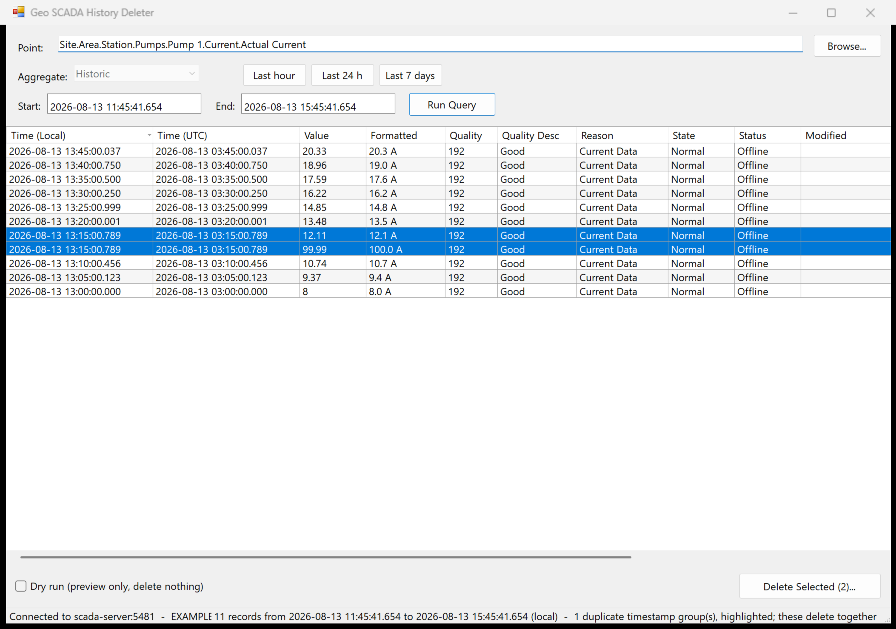
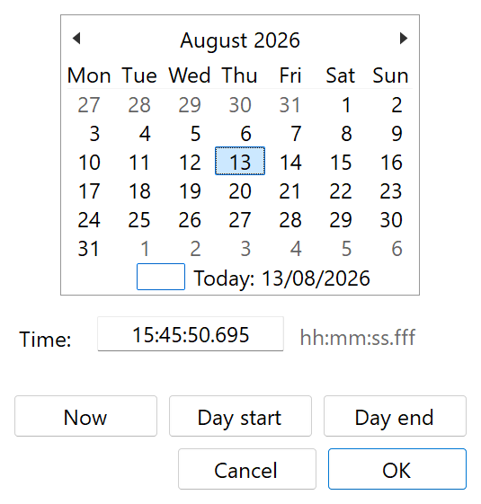

# Geo SCADA History Deleter

A small Windows tool for reviewing a point's historic data over a time range and permanently
deleting selected records, using the Geo SCADA .NET Client API.



The startup disclaimer, date picker and confirmation dialog are in [docs/](docs/).



## What it does

1. On launch it shows a disclaimer that must be accepted before it will connect to anything.
2. You enter (or search for) a point, a start time and an end time, all to millisecond resolution.
3. It runs a parameterised SQL query against `CDBHistoric` and lists the raw records, newest first.
4. You select one or more rows — `Ctrl+click` and `Shift+click` work as normal for bulk selection.
5. **Delete Selected** asks for confirmation, then permanently removes those values via
   `IHistory.DeleteHistoricData`.
6. The query is re-run automatically, both to refresh the grid and to *verify* the records really
   went — see [Timestamp precision](#timestamp-precision) for why that check is not optional.

## Requirements

- Windows 10 or 11 (or Windows Server 2016+). .NET Framework 4.8 is part of the OS — nothing to install.
- **The Geo SCADA (ClearSCADA) client software must be installed on the machine.** The tool binds to
  the installed `ClearScada.Client.dll` rather than shipping its own copy, so it always matches the
  product version on that machine.
- A Geo SCADA account with rights to read history and invoke the historic delete method on the
  points concerned.

## Which exe to run

| File | Use when |
| --- | --- |
| `HistoryDeleter.exe` | The Geo SCADA client is installed 64-bit (normal for current versions). |
| `HistoryDeleter32.exe` | Only a 32-bit Geo SCADA client is installed. |

`ClearScada.Client.dll` relies on the native `DBClient.dll`, which cannot be loaded across bitness,
so the exe has to match the install. If you pick the wrong one it says so at startup and names the
other. The install directory is found from
`HKLM\SOFTWARE\Schneider Electric\ClearSCADA` (`InstallLocation` / `InstallLocationx86`), falling
back to the usual `Program Files` locations.

## Using it

**Connecting.** On launch you are asked for server, port (default `5481`), user name and password.
Nothing is persisted — not the server, not the user name, and certainly not the password. The
password is held only as a `SecureString` for the duration of the logon call.

**Choosing a point.** Type a full name such as
`Site.Area.Station.Pumps.Pump 1.Current.Actual Current`, or press **Browse…** to search. The
browser only lists objects that actually store history (it joins `CDBObject` to `CDBHisBase`), so
anything it offers can be queried. If a point has more than one historic aggregate, the
**Aggregate** list becomes selectable; otherwise it shows the single one.

**Times.** Both fields take a full `yyyy-MM-dd HH:mm:ss.fff` value, typed directly or set from the
drop-down, which holds a calendar, a millisecond-capable time box and **Now / Day start / Day end**.
The stock Windows date picker is not used: it cannot edit fractional seconds at all, which is the
one thing this tool depends on. Both fields are local time, and **Last hour / Last 24 h /
Last 7 days** fill them in. The grid shows every timestamp twice, local and UTC, so there is no
ambiguity across a daylight-saving boundary.

**Duplicate timestamps.** Two records can share one instant. Deletion addresses instants, not
records, and there is no way to say which one to remove — the server takes the earliest-written.
Half-deleting such a group is therefore not a meaningful request, so rows sharing a timestamp are
highlighted, selecting one selects the rest, and they are removed together. The status bar reports
how many such groups a query returned.

**Sort order.** Records come back newest first. The row limit therefore keeps the *most recent*
records when a range is too wide. Clicking a column header re-sorts within the loaded rows.

<a name="timestamp-precision"></a>
## Timestamp precision

This is the subtlest part of the tool and the reason a first version appeared to work but did not.

The historian stores timestamps at **100 ns resolution**. Field-collected data really does use it —
a value logged by a timed report sits at, say, `04:41:36.0818871`. But the three ways of looking at
that one instant disagree:

| Source | Reports | Why |
| --- | --- | --- |
| Actual stored value | `04:41:36.0818871` | 100 ns ticks |
| SQL `"Time"` column | `04:41:36.0820000` | **rounded** to the nearest millisecond |
| ViewX display | `04:41:36.081` | **truncated** to the millisecond |

Deletion addresses a record by timestamp, so being a millisecond out means addressing nothing — and
the server **returns success anyway**, deleting nothing and reporting no error. That is a silent
data-integrity trap, so the tool deals with it in three ways:

- **It never deletes using the SQL timestamp.** The exact instant is recovered from `RecordId`,
  whose characters 8–24 are the timestamp as a hexadecimal Windows `FILETIME`. This has been checked
  against `IHistory.ReadRawHistory` across live records and agrees to the tick every time.
- **It refuses to guess.** The decoded value is accepted only if it agrees with the SQL column to
  within a millisecond. If a record id were ever laid out differently the check fails, the row is
  shown in red, and the tool declines to delete it rather than issuing a delete against a timestamp
  it invented.
- **It verifies afterwards.** Because a successful-looking call proves nothing, the automatic
  re-query is compared against what was deleted. Anything still present is reported as a failure,
  even though the server said the delete succeeded.

The grid displays milliseconds truncated, so it matches ViewX for the same record. The confirmation
dialog and the dry-run report show the full stored precision, so you can see exactly which instants
are about to be addressed.

Note that every *write* path (`InsertValue`, `LoadDataValue`, `EditHistoricData`) truncates to the
millisecond, so data created through the API cannot reproduce this; only field-collected data can.
That is worth knowing before writing any test for this behaviour — seeded data will pass happily
while real data fails.

## Deleting

**Which API, and why not the other one.** Deletion uses `IHistory.DeleteHistoricData`.

`CHistoryBase.DeleteValue` looks like the better choice on paper — it takes a `HistoricSourceType`
(raw / modified / both) and a comment that lands in the event journal. It was tried first, and it
does not work on real data. Invoking it through the generic object-method interface quantises its
timestamp argument to a millisecond, so it can only ever address records that happen to sit exactly
on a millisecond boundary. Against a live field-collected record stored at `…36.0818871`, the exact
value, the floored value and the ceiled value **all** reported success and deleted nothing;
`DeleteHistoricData` removed it first time. Its source type and comment are of no use if the record
survives, so the tool does not offer them:

- there is **no raw/modified selector** — `DeleteHistoricData` has no such argument;
- there is **no reason field** — it cannot record one, and asking for something that gets discarded
  would be worse than not asking.

Geo SCADA still journals every deletion against the point with your user name, client address and
the record's timestamp:

```
Historic record deleted at 13/08/2026 04:54:56.871      <user>   <client address>
```

**Dry run.** Tick **Dry run** to have the confirmation step report exactly which timestamps would go,
at full precision, without making any server call at all.

**Confirmation.** Deleting always shows a confirmation listing the point, aggregate, method, record
count and the earliest/latest timestamps at full stored resolution in both local time and UTC.

Deletion runs on a worker thread with a cancellable progress dialog, in batches of 200 timestamps
per call. If a batch fails it is retried one record at a time so the error can be attributed to the
record that actually caused it.

One array entry removes **one** record at that instant, not every record sharing it — verified on
the server, where `[t]` left one of a duplicate pair standing and `[t, t]` cleared both. The tool
therefore passes one entry per selected record and deliberately does not de-duplicate, and the
read-back check counts records per instant rather than merely testing for presence, so a partly
deleted duplicate group is reported rather than passing as a clean success.

## Building

Run `build.ps1`. It uses the C# compiler included with the .NET Framework
(`%WINDIR%\Microsoft.NET\Framework64\v4.0.30319\csc.exe`), so no Visual Studio, .NET SDK or NuGet
restore is needed — just Windows and the Geo SCADA client for the reference assembly. Output goes to
`bin\`.

```powershell
.\build.ps1
```

## Source layout

| File | Purpose |
| --- | --- |
| `src/Program.cs` | Entry point. Wires up assembly resolution before any ClearScada type is touched. |
| `src/DisclaimerForm.cs` | Startup disclaimer that must be accepted. |
| `src/GeoScadaClient.cs` | Locates the installed client and makes its managed and native DLLs loadable. |
| `src/Session.cs` | The connection and every server call: resolve, search, read history, delete. |
| `src/LoginForm.cs` | Connection dialog. |
| `src/MainForm.cs` | Query fields, results grid, delete action. |
| `src/PointPickerForm.cs` | Point search dialog. |
| `src/ConfirmDeleteForm.cs` | Confirmation, showing full timestamp precision. |
| `src/ProgressForm.cs` | Cancellable progress for the delete loop. |
| `src/DateTimeBox.cs` | Millisecond date/time field and its calendar drop-down. |
| `src/ScaledForm.cs` | Shared high-DPI scaling for the hand-coded layouts. |

## Notes and limitations

- **Windows pass-through authentication is not supported** — a user name and password are required.
- A single query returns at most 50,000 rows, newest first; the status bar says so when the cap is hit.
- The point search returns at most 500 matches and tells you when it truncates.
- The exact-timestamp recovery relies on the layout of `CDBHistoric.RecordId`, which is not a
  documented interface. It is cross-checked against the SQL timestamp on every row and deletion is
  refused if the two disagree, so a change in that layout degrades to "cannot delete" rather than
  "deletes the wrong record".
- Deletion is permanent. There is no undo, in this tool or in Geo SCADA.
- The disclaimer text is modelled on the one in
  [Get-VvxScadaSessions](https://github.com/adamwoodland2/GeoSCADA-Get-VvxScadaSessions). It refers
  to the GNU GPL v3; add a `LICENSE` file alongside the tool if you distribute it.
